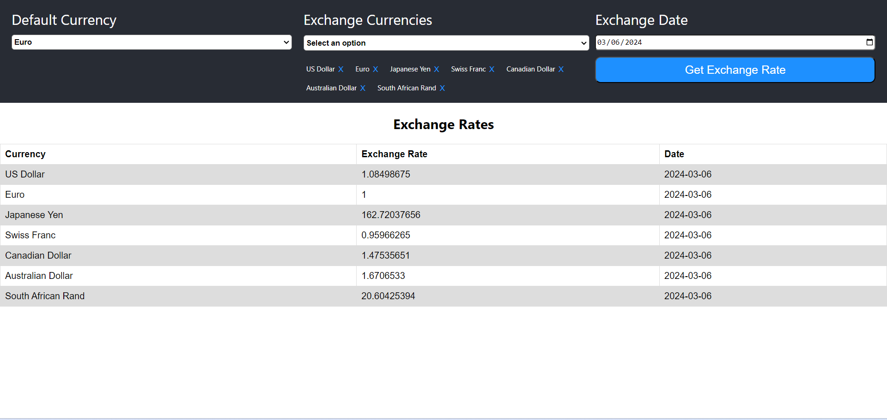

# Getting Started with Create React App

This project was bootstrapped with [Create React App](https://github.com/facebook/create-react-app).

## Available Scripts

In the project directory, you can run:

### `npm install`

Install the dependencies

### `npm start`

Runs the app in the development mode.\
Open [http://localhost:3000](http://localhost:3000) to view it in your browser.

The page will display currencyExchange on the landing page.
You may also see any lint errors in the console.

## Landing Page

## Functionality Details
Display two dropdowns - 
1. One is Currency dropdown
2. Second is Date Dropdown
3. Third dropdown contains exchange currency
4. Click on Get Exchange rate button to get details

On change on any of the dropdowns, we make an api calls and update the table below 